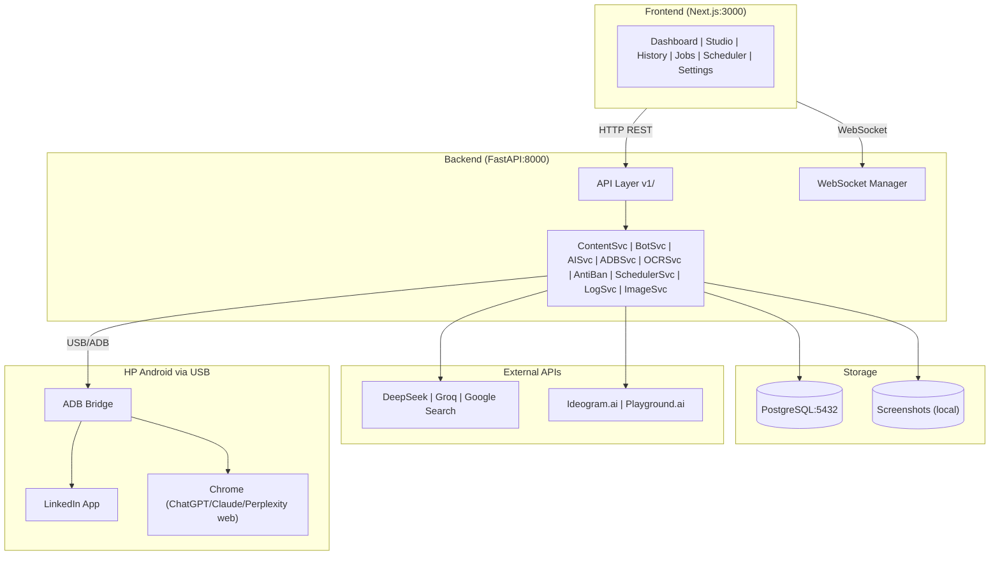
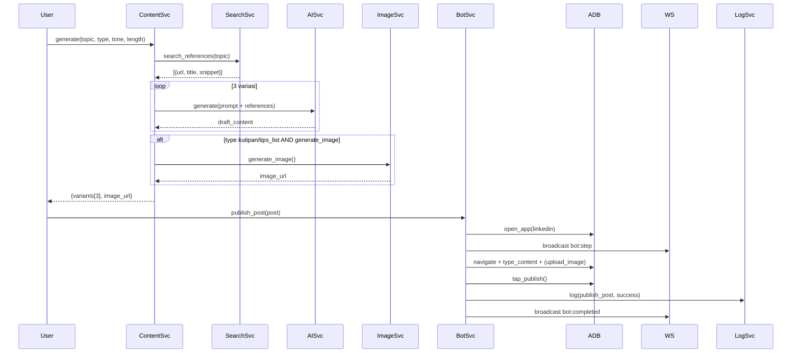
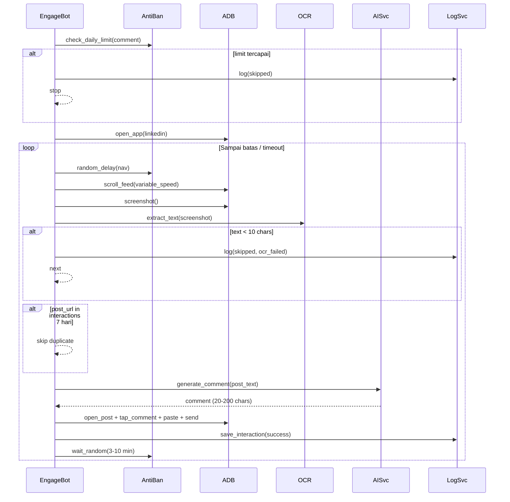
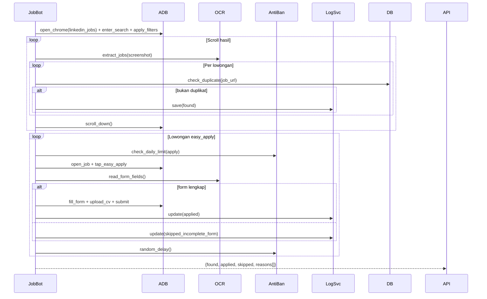
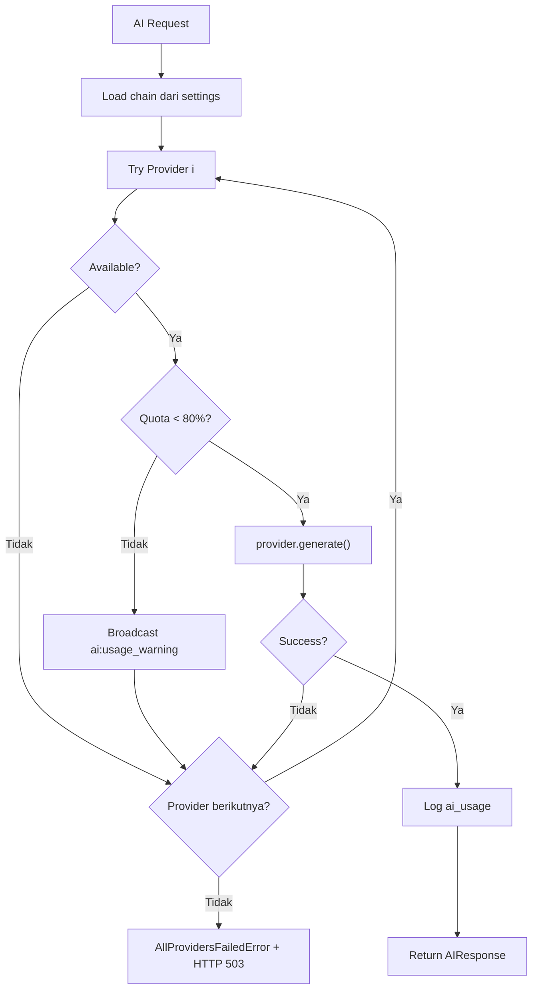
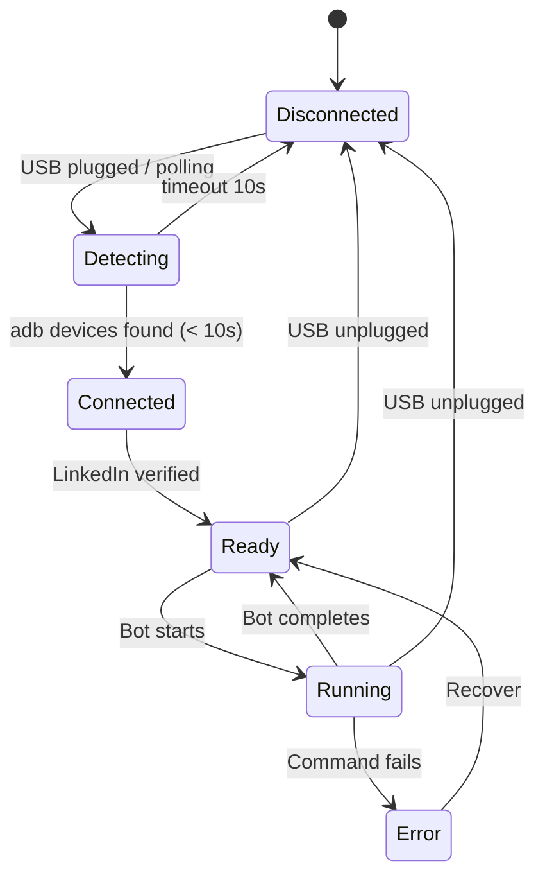
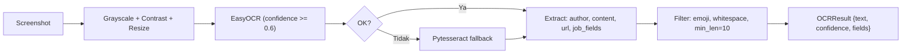

# Design Document — LinkedIn Automation Bot

## Overview

LinkedIn Automation Bot adalah sistem otomasi berbasis web yang menggunakan HP Android sebagai eksekutor fisik melalui ADB. Backend Python/FastAPI bertindak sebagai koordinator, dashboard Next.js sebagai antarmuka kontrol. Empat modul utama: Content Posting (A), Promosi (B), Auto Engage (C), Job Hunter (D) — semuanya memanfaatkan AI multi-provider dengan fallback chain otomatis.

**Batasan:** HP Android via USB (USB Debugging aktif), AI free tier dimonitor ketat, aksi LinkedIn berjalan melalui HP fisik, batas harian per modul untuk anti-ban.

---

## Architecture

### Diagram Sistem



**Docker Compose:** frontend ↔ backend ↔ postgres. Backend memerlukan `/dev/bus/usb` mount atau `--privileged` untuk ADB.

---

## Components and Interfaces

### API Routes (v1/)

| Method | Path | Handler |
|--------|------|---------|
| POST | `/posts/generate` | ContentService.generate() |
| CRUD | `/posts/` | PostService |
| POST | `/posts/{id}/publish` | BotService.publish_post() |
| GET/POST | `/bot/status`, `/bot/run`, `/bot/stop` | BotService |
| GET | `/logs/`, `/logs/{id}`, `/logs/export` | LogService, ExportService |
| GET | `/interactions/`, `/interactions/export` | InteractionService |
| GET/POST | `/jobs/`, `/jobs/search`, `/jobs/export` | JobService, BotService |
| CRUD | `/schedules/`, `/schedules/{id}/toggle` | SchedulerService |
| GET/PUT | `/settings/` | SettingsService |
| GET | `/ai-usage/`, `/ai-usage/summary` | AIUsageService |
| GET | `/device/status` | ADBService |

### Service Interfaces

```python
# services/ai/base.py
@dataclass
class AIRequest:
    prompt: str
    system_prompt: Optional[str] = None
    max_tokens: int = 2048
    temperature: float = 0.7

@dataclass
class AIResponse:
    content: str
    provider: str
    prompt_tokens: int
    completion_tokens: int
    cost_estimate: float
    success: bool
    error: Optional[str] = None

class AIProvider(ABC):
    provider_name: str
    @abstractmethod
    async def generate(self, request: AIRequest) -> AIResponse: ...
    @abstractmethod
    async def is_available(self) -> bool: ...
    @abstractmethod
    def get_token_limit(self) -> int: ...
```

```python
# services/adb/client.py
@dataclass
class DeviceStatus:
    connected: bool
    device_id: Optional[str]
    model: Optional[str]
    android_version: Optional[str]
    linkedin_installed: bool
    last_checked: datetime

class ADBClient:
    COMMAND_TIMEOUT = 30  # detik
    # Koordinat relatif (0.0-1.0) → dikonversi ke pixel aktual saat runtime
    LINKEDIN_UI_MAP = {
        "new_post_button": (0.5, 0.92), "post_input": (0.5, 0.35),
        "publish_button": (0.85, 0.08), "comment_button": (0.15, 0.88),
        "jobs_search_bar": (0.5, 0.12),
    }
    async def get_status(self) -> DeviceStatus: ...
    async def tap(self, x: float, y: float) -> bool: ...
    async def swipe(self, x1: float, y1: float, x2: float, y2: float, duration_ms: int) -> bool: ...
    async def type_text(self, text: str) -> bool: ...
    async def screenshot(self) -> bytes: ...
    async def open_app(self, package: str) -> bool: ...
    async def press_key(self, keycode: int) -> bool: ...
    async def set_clipboard(self, text: str) -> bool: ...
    async def get_clipboard(self) -> str: ...

    async def _run_command(self, cmd: List[str], timeout: int = None) -> ADBResult:
        timeout = timeout or self.COMMAND_TIMEOUT
        try:
            proc = await asyncio.create_subprocess_exec(*cmd,
                stdout=asyncio.subprocess.PIPE, stderr=asyncio.subprocess.PIPE)
            stdout, stderr = await asyncio.wait_for(proc.communicate(), timeout=timeout)
            return ADBResult(success=proc.returncode == 0,
                             output=stdout.decode(), error=stderr.decode())
        except asyncio.TimeoutError:
            proc.kill()
            raise ADBCommandTimeoutError(f"ADB timeout {timeout}s")
```

```python
# services/bot/base_bot.py
class BaseBot(ABC):
    def __init__(self, adb: ADBClient, anti_ban: AntiBanController, log_service: LogService):
        self.adb, self.anti_ban, self.log_service = adb, anti_ban, log_service
        self._running = False

    @abstractmethod
    async def execute(self, config: dict) -> BotResult: ...

    async def stop(self):
        self._running = False

    async def _log_step(self, action: str, status: str, message: str, screenshot: bool = True):
        path = None
        if screenshot and self._running:
            path = await self._save_screenshot(await self.adb.screenshot())
        await self.log_service.write(action=action, status=status,
                                     message=message, screenshot_path=path)
```

---

## WebSocket Events

### Server → Client

| Event | Payload | Keterangan |
|-------|---------|------------|
| `device:status` | `connected, device_id, model, linkedin_installed` | Polling 5s |
| `bot:started` | `module, task_id, started_at` | Bot mulai |
| `bot:step` | `task_id, step, message, status, timestamp` | Satu langkah |
| `bot:completed` | `task_id, module, duration_ms, result_summary` | Selesai |
| `bot:error` | `task_id, error, step, screenshot_path` | Error |
| `bot:stopped` | `task_id, reason` | Dihentikan manual |
| `log:new` | `log_entry` | Log baru |
| `ai:usage_warning` | `provider, usage_percent, threshold` | Quota 80% |
| `captcha:detected` | `screenshot_path, timestamp` | CAPTCHA |
| `scheduler:triggered` | `schedule_id, task_type` | Jadwal |

### Client → Server

| Event | Payload |
|-------|---------|
| `bot:stop_request` | `task_id` |
| `subscribe:device` | `{}` |

---

## Data Models

### Database Schema

```sql
-- POSTS
CREATE TABLE posts (
    id                SERIAL PRIMARY KEY,
    title             VARCHAR(255),
    content           TEXT NOT NULL,
    content_type      VARCHAR(50) NOT NULL CHECK (content_type IN (
                        'storytelling','tips_list','pertanyaan','kutipan',
                        'video_script','thread','promo','promo_portofolio','promo_testimoni')),
    status            VARCHAR(20) NOT NULL DEFAULT 'draft'
                      CHECK (status IN ('draft','scheduled','posted','failed')),
    platform          VARCHAR(30) NOT NULL DEFAULT 'linkedin',
    image_url         TEXT,
    is_thread         BOOLEAN NOT NULL DEFAULT FALSE,
    thread_parts      JSONB,           -- [{part_number, content, char_count}]
    thread_count      INTEGER DEFAULT 1,
    scheduled_at      TIMESTAMPTZ,
    posted_at         TIMESTAMPTZ,
    likes             INTEGER DEFAULT 0,
    comments          INTEGER DEFAULT 0,
    shares            INTEGER DEFAULT 0,
    ai_provider_used  VARCHAR(50),
    prompt_used       TEXT,
    tone              VARCHAR(50),
    search_references JSONB,           -- [{url, title, snippet}]
    linkedin_post_id  VARCHAR(100),
    created_at        TIMESTAMPTZ NOT NULL DEFAULT NOW(),
    updated_at        TIMESTAMPTZ NOT NULL DEFAULT NOW()
);
CREATE INDEX idx_posts_status ON posts(status);
CREATE INDEX idx_posts_created_at ON posts(created_at DESC);

-- BOT_LOGS
CREATE TABLE bot_logs (
    id              SERIAL PRIMARY KEY,
    post_id         INTEGER REFERENCES posts(id) ON DELETE SET NULL,
    task_id         VARCHAR(36) NOT NULL,
    action          VARCHAR(50) NOT NULL CHECK (action IN (
                        'generate_content','search_reference','generate_image',
                        'open_linkedin','navigate_post','type_content','upload_image',
                        'publish_post','screenshot','scroll_feed','read_ocr',
                        'generate_comment','post_comment','open_jobs','search_jobs',
                        'extract_jobs','easy_apply','fill_form','open_ai_web',
                        'paste_prompt','copy_response','detect_captcha',
                        'idle_wait','anti_ban_delay')),
    status          VARCHAR(20) NOT NULL CHECK (status IN ('success','failed','running','skipped','timeout')),
    message         TEXT,
    error_detail    TEXT,
    stack_trace     TEXT,
    screenshot_path TEXT,
    duration_ms     INTEGER,
    module          VARCHAR(10),   -- A, B, C, D
    metadata        JSONB,
    created_at      TIMESTAMPTZ NOT NULL DEFAULT NOW()
);
CREATE INDEX idx_bot_logs_task_id ON bot_logs(task_id);
CREATE INDEX idx_bot_logs_created_at ON bot_logs(created_at DESC);

-- INTERACTIONS
CREATE TABLE interactions (
    id               SERIAL PRIMARY KEY,
    target_post_url  TEXT NOT NULL,
    target_author    VARCHAR(255),
    target_post_text TEXT,
    action_type      VARCHAR(30) NOT NULL CHECK (action_type IN ('comment','react','share','connect')),
    content_sent     TEXT,
    status           VARCHAR(20) NOT NULL CHECK (status IN ('success','failed','skipped')),
    skip_reason      VARCHAR(100),
    ai_provider_used VARCHAR(50),
    screenshot_path  TEXT,
    created_at       TIMESTAMPTZ NOT NULL DEFAULT NOW()
);
CREATE INDEX idx_interactions_target_url ON interactions(target_post_url);
CREATE INDEX idx_interactions_created_at ON interactions(created_at DESC);

-- JOB_APPLICATIONS
CREATE TABLE job_applications (
    id                 SERIAL PRIMARY KEY,
    job_title          VARCHAR(255) NOT NULL,
    company            VARCHAR(255) NOT NULL,
    location           VARCHAR(255),
    salary_range       VARCHAR(100),
    job_url            TEXT UNIQUE NOT NULL,
    status             VARCHAR(40) NOT NULL DEFAULT 'found'
                       CHECK (status IN ('found','applied','skipped','rejected',
                                         'interview','offer',
                                         'skipped_incomplete_form','skipped_no_easy_apply')),
    has_easy_apply     BOOLEAN DEFAULT FALSE,
    job_type           VARCHAR(30),
    applied_at         TIMESTAMPTZ,
    notes              TEXT,
    form_fields_filled JSONB,
    search_session_id  VARCHAR(36),
    screenshot_path    TEXT,
    created_at         TIMESTAMPTZ NOT NULL DEFAULT NOW(),
    updated_at         TIMESTAMPTZ NOT NULL DEFAULT NOW()
);
CREATE INDEX idx_jobs_status ON job_applications(status);
CREATE INDEX idx_jobs_created_at ON job_applications(created_at DESC);

-- AI_USAGE
CREATE TABLE ai_usage (
    id                SERIAL PRIMARY KEY,
    provider          VARCHAR(50) NOT NULL CHECK (provider IN (
                        'deepseek','groq','chatgpt_web','claude_web','perplexity_web')),
    prompt_tokens     INTEGER NOT NULL DEFAULT 0,
    completion_tokens INTEGER NOT NULL DEFAULT 0,
    total_tokens      INTEGER GENERATED ALWAYS AS (prompt_tokens + completion_tokens) STORED,
    cost_estimate     NUMERIC(10,6) DEFAULT 0,
    module            VARCHAR(10),
    task_id           VARCHAR(36),
    success           BOOLEAN NOT NULL DEFAULT TRUE,
    error_message     TEXT,
    latency_ms        INTEGER,
    created_at        TIMESTAMPTZ NOT NULL DEFAULT NOW()
);
CREATE INDEX idx_ai_usage_provider ON ai_usage(provider);
CREATE INDEX idx_ai_usage_created_at ON ai_usage(created_at DESC);

-- SCHEDULES
CREATE TABLE schedules (
    id                SERIAL PRIMARY KEY,
    name              VARCHAR(100) NOT NULL,
    task_type         VARCHAR(30) NOT NULL CHECK (task_type IN ('post_konten','engage','job_hunt','promosi')),
    cron_expression   VARCHAR(100),
    scheduled_once_at TIMESTAMPTZ,
    is_active         BOOLEAN NOT NULL DEFAULT TRUE,
    last_run          TIMESTAMPTZ,
    last_status       VARCHAR(20),
    next_run          TIMESTAMPTZ,
    retry_count       INTEGER DEFAULT 0,
    max_retries       INTEGER DEFAULT 3,
    config_json       JSONB NOT NULL DEFAULT '{}',
    run_count         INTEGER DEFAULT 0,
    failure_count     INTEGER DEFAULT 0,
    created_at        TIMESTAMPTZ NOT NULL DEFAULT NOW(),
    updated_at        TIMESTAMPTZ NOT NULL DEFAULT NOW()
);
CREATE INDEX idx_schedules_active ON schedules(is_active);
CREATE INDEX idx_schedules_next_run ON schedules(next_run);

-- SETTINGS (key-value store)
CREATE TABLE settings (
    id          SERIAL PRIMARY KEY,
    key         VARCHAR(100) UNIQUE NOT NULL,
    value       JSONB NOT NULL,
    description TEXT,
    updated_at  TIMESTAMPTZ NOT NULL DEFAULT NOW()
);
INSERT INTO settings (key, value, description) VALUES
('ai_provider_chain',  '["deepseek","groq","chatgpt_web","claude_web"]', 'Urutan provider AI'),
('ai_usage_limits',    '{"deepseek":500000,"groq":30000,"chatgpt_web":100,"claude_web":50,"perplexity_web":50}', 'Batas token/bulan'),
('anti_ban_limits',    '{"posts_per_day":3,"comments_per_day":15,"applies_per_day":20}', 'Batas aksi/hari'),
('anti_ban_delays',    '{"tap_min_ms":1000,"tap_max_ms":3000,"nav_min_ms":2000,"nav_max_ms":5000}', 'Range delay ADB'),
('content_language',   '"indonesia"', 'Bahasa konten default'),
('cv_path',            'null', 'Path CV untuk auto apply'),
('screenshot_enabled', 'true', 'Screenshot tiap aksi');
```

### Pydantic Schemas (Ringkas)

```python
# schemas/post.py
class ContentType(str, Enum):
    storytelling = "storytelling"; tips_list = "tips_list"; pertanyaan = "pertanyaan"
    kutipan = "kutipan"; video_script = "video_script"; thread = "thread"; promo = "promo"

class ContentTone(str, Enum):
    profesional = "profesional"; kasual = "kasual"; inspiratif = "inspiratif"; edukasi = "edukasi"

class ContentLength(str, Enum):
    pendek = "pendek"    # ~300 chars
    sedang = "sedang"    # ~1000 chars
    panjang = "panjang"  # ~2500 chars

class PostGenerateRequest(BaseModel):
    topic: str
    description: Optional[str] = None
    content_type: ContentType
    tone: ContentTone
    length: ContentLength
    generate_image: bool = False

class PostGenerateResponse(BaseModel):
    variants: List[PostGenerateVariant]  # Selalu 3 item
    image_url: Optional[str]
    search_references: List[dict]
    ai_provider_used: str

class PostRead(BaseModel):
    id: int; title: Optional[str]; content: str; content_type: str; status: str
    image_url: Optional[str]; scheduled_at: Optional[datetime]; posted_at: Optional[datetime]
    likes: int; comments: int; shares: int; ai_provider_used: Optional[str]
    created_at: datetime; updated_at: datetime
    class Config: from_attributes = True
```

---

## API Endpoint Specifications

### POST /api/v1/posts/generate

**Request:** `{topic, description?, content_type, tone, length, generate_image}`

**Response 200:**
```json
{
  "variants": [
    {"content": "5 Cara...", "char_count": 987, "hashtags": ["#produktivitas"]},
    {"content": "Inilah...", "char_count": 850, "hashtags": ["#karir"]},
    {"content": "Apakah...", "char_count": 1020, "hashtags": ["#tips"]}
  ],
  "image_url": "https://ideogram.ai/...",
  "search_references": [{"url": "...", "title": "...", "snippet": "..."}],
  "ai_provider_used": "deepseek"
}
```
**422** — validasi gagal | **503** — semua AI provider tidak tersedia

---

### POST /api/v1/posts/{id}/publish

**Response 200:** `{"task_id": "uuid", "status": "started", "started_at": "ISO"}`  
**409** — bot sudah berjalan | **503** — HP tidak terhubung

---

### POST /api/v1/bot/run

**Request:** `{"module": "C", "config": {"max_comments": 5, "topic_keywords": ["tech"]}}`  
**Response 200:** `{"task_id": "uuid", "module": "C", "status": "started"}`

---

### GET /api/v1/logs

**Query:** `status`, `action`, `module`, `date_from`, `date_to`, `page`(1), `limit`(50, max 200)

**Response 200:**
```json
{"items": [{"id":1,"task_id":"...","action":"publish_post","status":"success",
  "duration_ms":4320,"screenshot_path":"...","created_at":"..."}],
 "total":150,"page":1,"limit":50}
```

---

### GET /api/v1/logs/export

**Query:** `date_from`, `date_to`, `status`, `module`  
**Response 200:** CSV download, `Content-Type: text/csv; charset=utf-8-bom`

---

### POST /api/v1/jobs/search

**Request:** `{"titles": [...], "skills": [...], "location": "Jakarta", "job_type": "full-time"}`  
**Response 200:** `{"task_id": "uuid", "status": "started"}`

---

### GET /api/v1/ai-usage/summary

**Response 200:**
```json
{"period_days": 30, "providers": [
  {"provider":"deepseek","total_tokens":125000,"cost_estimate_usd":0.05,
   "limit":500000,"usage_percent":25.0,"call_count":48}
]}
```

---

### PUT /api/v1/settings

**Request:** `{"anti_ban_delays":{...}, "anti_ban_limits":{...}, "ai_provider_chain":[...]}`

**Response 422:**
```json
{"detail": [{"field": "anti_ban_delays.tap_min_ms", "message": "harus < tap_max_ms", "given": 5000}]}
```

---

## Flow Diagrams

### Module A — Content Posting



### Module C — Auto Engage



### Module D — Job Hunter



### AI Provider Chain



---

## ADB Service Architecture

### Device State Machine



### Clipboard untuk Teks Panjang

```python
# services/adb/clipboard.py — untuk teks > 50 chars
async def paste_via_clipboard(adb: ADBClient, text: str):
    escaped = text.replace("'", "\\'")
    await adb._run_command(["adb","shell","am","broadcast",
        "-a","clipper.set","-e","text",f"'{escaped}'"])
    await asyncio.sleep(0.3)
    await adb.press_key(279)  # KEYCODE_PASTE
```

### OCR Pipeline



---

## Anti-Ban Strategy

### Delay Manager

```python
# services/anti_ban/delay.py
class DelayManager:
    def __init__(self, settings):
        self.tap_range   = (settings.tap_min_ms, settings.tap_max_ms)   # 1000-3000ms
        self.nav_range   = (settings.nav_min_ms, settings.nav_max_ms)   # 2000-5000ms
        self.comment_gap = (3*60*1000, 10*60*1000)                       # 3-10 menit
        self.session_gap = 30 * 60                                        # 30 menit

    async def tap_delay(self):   await asyncio.sleep(random.randint(*self.tap_range) / 1000)
    async def nav_delay(self):   await asyncio.sleep(random.randint(*self.nav_range) / 1000)
    async def comment_delay(self): await asyncio.sleep(random.randint(*self.comment_gap) / 1000)
    async def idle_action(self): await asyncio.sleep(random.randint(5, 30))
```

### Daily Limiter (DB-backed)

```python
# services/anti_ban/limiter.py
class DailyLimiter:
    async def check_limit(self, module: str, db: Session) -> bool:
        limits = await settings_service.get_anti_ban_limits()
        today_start = datetime.combine(date.today(), time.min, tzinfo=timezone.utc)
        if module == "post":
            count = db.query(func.count(Post.id)).filter(
                Post.status=='posted', Post.posted_at >= today_start).scalar()
            return count < limits["posts_per_day"]
        elif module == "comment":
            count = db.query(func.count(Interaction.id)).filter(
                Interaction.action_type=='comment', Interaction.status=='success',
                Interaction.created_at >= today_start).scalar()
            return count < limits["comments_per_day"]
        elif module == "apply":
            count = db.query(func.count(JobApplication.id)).filter(
                JobApplication.status=='applied',
                JobApplication.applied_at >= today_start).scalar()
            return count < limits["applies_per_day"]
        return True
```

### Scroll Simulator

```python
# services/anti_ban/scroll_simulator.py
class ScrollSimulator:
    PATTERNS = ["slow_read", "skim", "deep_read"]

    async def scroll_feed(self, adb: ADBClient, pattern: str = None):
        p = pattern or random.choice(self.PATTERNS)
        if p == "slow_read":    # Baca pelan, sering berhenti
            for _ in range(random.randint(3, 7)):
                await adb.swipe(0.5, 0.7, 0.5, 0.3, duration_ms=random.randint(800, 1500))
                await asyncio.sleep(random.uniform(1.5, 4.0))
        elif p == "skim":       # Scroll cepat
            for _ in range(random.randint(8, 15)):
                await adb.swipe(0.5, 0.8, 0.5, 0.2, duration_ms=random.randint(300, 600))
                await asyncio.sleep(random.uniform(0.3, 1.0))
        elif p == "deep_read":  # Sangat lambat
            for _ in range(random.randint(2, 4)):
                await adb.swipe(0.5, 0.7, 0.5, 0.4, duration_ms=random.randint(1200, 2000))
                await asyncio.sleep(random.uniform(5.0, 15.0))
```

### CAPTCHA Detection

```python
CAPTCHA_KEYWORDS = [
    "verify","verifikasi","captcha","robot","security check",
    "pemeriksaan keamanan","prove you're human","unusual activity"
]
async def detect_captcha(screenshot: bytes, ocr: OCREngine) -> bool:
    result = await ocr.extract_text(screenshot)
    return any(kw in result.text.lower() for kw in CAPTCHA_KEYWORDS)
```

Saat terdeteksi: stop semua bot → log `detect_captcha/failed` → WS `captcha:detected` → dashboard notif merah permanen.

---

## Frontend Component Hierarchy (Atomic Design)

### Pemetaan Halaman

```
pages/index.tsx     → DashboardTemplate
  StatCard×4 | DeviceStatus | BotProgressPanel | AIUsagePanel

pages/studio.tsx    → StudioTemplate
  StudioForm (FormField×N + ContentTypeSelector + ToneSelector)
  ContentPreview (PostCard + Button×3)
  AIProviderBadge

pages/history.tsx   → HistoryTemplate
  LogTable (LogFilters + LogRow×N) | LogDetail (modal)

pages/jobs.tsx      → JobsTemplate
  SearchBar | StatCard×3 | JobTable (JobFilters + JobCard×N)

pages/scheduler.tsx → SchedulerTemplate
  SchedulerCalendar

pages/settings.tsx  → SettingsTemplate
  FormField×N | Button(Simpan)
```

### Atoms

| Komponen | Props Utama |
|----------|-------------|
| `Button` | `variant`(primary/secondary/danger/ghost), `size`, `loading`, `disabled` |
| `Badge` | `color`(green/red/yellow/blue/gray), `label` |
| `Input` | `value`, `onChange`, `error`, `placeholder` |
| `Textarea` | `value`, `onChange`, `maxLength`, `rows` |
| `Select` | `options[]`, `value`, `onChange` |
| `Spinner` | `size`(sm/md/lg), `color` |
| `StatusDot` | `status`(online/offline/warning/error) |
| `Icon` | `name`, `size`, `color` (Lucide React) |

### Molecules

| Komponen | Fungsi |
|----------|--------|
| `FormField` | Label + Input/Textarea/Select + error message |
| `StatCard` | Icon + angka + label + trend Badge |
| `PostCard` | Preview satu post LinkedIn |
| `JobCard` | Info lowongan + status Badge |
| `LogRow` | Baris tabel log dengan StatusDot |
| `AIProviderBadge` | Badge provider + progress bar quota |
| `ProgressStep` | StatusDot + Spinner + pesan step bot |
| `ToastNotif` | Pop-up notifikasi dengan auto-dismiss |

### Organisms

| Komponen | Fungsi |
|----------|--------|
| `Sidebar` | Navigasi kiri |
| `TopBar` | Header halaman |
| `DeviceStatus` | Panel status HP (model, connected, LinkedIn) |
| `StudioForm` | Form lengkap input konten |
| `ContentPreview` | Preview WYSIWYG + actions |
| `LogTable` | Tabel history dengan filter + pagination |
| `LogDetail` | Modal detail log + screenshot |
| `JobTable` | Tabel lowongan |
| `BotProgressPanel` | Real-time steps via WebSocket |
| `SchedulerCalendar` | Kalender visual jadwal |
| `AIUsagePanel` | Monitoring quota provider |

---

## State Management (Zustand)

```typescript
// store/botStore.ts
interface BotState {
  isRunning: boolean
  currentModule: 'A' | 'B' | 'C' | 'D' | null
  taskId: string | null
  steps: BotStep[]
  error: string | null
  setRunning(running: boolean, module?: string, taskId?: string): void
  addStep(step: BotStep): void
  setError(error: string | null): void
  reset(): void
}

// store/deviceStore.ts
interface DeviceState {
  connected: boolean; deviceId: string | null; model: string | null
  linkedinInstalled: boolean; lastChecked: Date | null
  updateStatus(s: Partial<DeviceState>): void
}

// store/notifStore.ts
interface NotifState {
  toasts: Toast[]  // Toast: {id, type, message, duration?}
  addToast(t: Omit<Toast, 'id'>): void
  removeToast(id: string): void
}
```

### WebSocket Hook

```typescript
// hooks/useWebSocket.ts
export function useWebSocket() {
  const { setRunning, addStep, setError } = useBotStore()
  const updateDevice = useDeviceStore(s => s.updateStatus)
  const addToast = useNotifStore(s => s.addToast)

  useEffect(() => {
    const ws = new WebSocket(process.env.NEXT_PUBLIC_WS_URL!)
    ws.onmessage = ({ data }) => {
      const { type, payload } = JSON.parse(data)
      switch (type) {
        case 'device:status':    updateDevice(payload); break
        case 'bot:started':      setRunning(true, payload.module, payload.task_id); break
        case 'bot:step':         addStep(payload); break
        case 'bot:completed':    setRunning(false); addToast({ type: 'success', message: 'Bot selesai' }); break
        case 'bot:error':        setError(payload.error); addToast({ type: 'error', message: payload.error }); break
        case 'ai:usage_warning': addToast({ type: 'warning', message: `${payload.provider}: ${payload.usage_percent}% quota` }); break
        case 'captcha:detected': addToast({ type: 'error', message: 'CAPTCHA! Bot dihentikan.', duration: 0 }); break
      }
    }
    return () => ws.close()
  }, [])
}
```

---

## Error Handling Strategy

### Error Taxonomy

```
AppError
├── ADBError: DeviceNotFound | CommandTimeout | LinkedInNotFound | Permission
├── AIServiceError: AllProvidersFailed | QuotaExceeded | Timeout | AuthError
├── OCRError: LowConfidence | EmptyText
├── BotError: DailyLimitExceeded | CaptchaDetected | UIElementNotFound
└── ValidationError: InvalidConfig | DuplicateJob
```

### HTTP Status Codes

| Status | Kondisi |
|--------|---------|
| 400 | Format request salah |
| 404 | Resource tidak ditemukan |
| 409 | Conflict (bot jalan, job duplikat) |
| 422 | Validasi gagal dengan detail field |
| 429 | Batas harian tercapai |
| 503 | HP disconnect / semua AI gagal |

### Error Response Format

```json
{
  "error": {
    "code": "ADB_DEVICE_NOT_FOUND",
    "message": "HP Android tidak terdeteksi. Pastikan USB Debugging aktif.",
    "details": {"last_known_device": "Redmi Note 10"}
  }
}
```

### Handling per Skenario

| Skenario | Komponen | Respons |
|----------|----------|---------|
| HP disconnect idle | ADB Detector (poll 5s) | WS `device:status` + toast |
| HP disconnect saat bot | `BaseBot._log_step()` | Stop, log failed, WS `bot:error` |
| ADB timeout 30s | `ADBClient._run_command()` | `ADBCommandTimeoutError`, bot stop |
| AI provider gagal | `ProviderChain` | Try next provider |
| Semua AI gagal | `ProviderChain` | HTTP 503, log, WS notif |
| CAPTCHA | `AntiBanController` | Stop semua, WS `captcha:detected` |
| Batas harian | `DailyLimiter` | HTTP 429, log, toast |
| Easy Apply incomplete | `JobBot._fill_form()` | Skip + log `skipped_incomplete_form` |
| OCR confidence rendah | `OCREngine` | Fallback → skip |
| Config invalid | Pydantic | HTTP 422 + field detail |

---

## Security Considerations

- **Input sanitization**: Teks ADB di-escape; prompt AI di-sanitize dari OCR output (prompt injection)
- **CORS**: Origin whitelist dari env `ALLOWED_ORIGINS`
- **Rate limiting**: `slowapi` 60 req/menit per IP
- **File upload**: CV dibatasi PDF/DOCX max 5MB
- **Secrets**: API key di `.env` (gitignored), tidak hardcoded
- **WebSocket**: Validasi origin header saat handshake
- **Risk**: Otomasi LinkedIn dapat melanggar ToS. User bertanggung jawab penuh.

---

## Correctness Properties

*A property is a characteristic or behavior that should hold true across all valid executions of a system — essentially, a formal statement about what the system should do. Properties serve as the bridge between human-readable specifications and machine-verifiable correctness guarantees.*

### Property 1: Thread Split Invariant

*For any* konten LinkedIn yang di-split menjadi thread, setiap bagian harus memiliki panjang ≤ 3.000 karakter dan total bagian ≤ 10.

**Validates: Requirements 2.11**

---

### Property 2: Minimal 3 Variasi Konten

*For any* request generate konten dengan input valid, sistem mengembalikan tepat 3 variasi yang masing-masing non-empty.

**Validates: Requirements 2.4**

---

### Property 3: Panjang Komentar Engage

*For any* teks post yang diekstrak OCR (panjang ≥ 10 chars), komentar yang dihasilkan AI harus memiliki panjang antara 20 dan 200 karakter inklusif.

**Validates: Requirements 4.4**

---

### Property 4: Batas Harian Anti-Ban Tidak Terlampaui

*For any* hari kalender, jumlah komentar sukses ≤ `comments_per_day`, lamaran sukses ≤ `applies_per_day`, dan post sukses ≤ `posts_per_day` sesuai konfigurasi aktif.

**Validates: Requirements 4.7, 5.7, 9.2, 9.3**

---

### Property 5: Idempotency Penyimpanan Lowongan

*For any* URL lowongan, menyimpan dua kali dengan URL sama tidak menghasilkan lebih dari satu entri di `job_applications`.

**Validates: Requirements 5.4**

---

### Property 6: Kelengkapan Entry Bot Log

*For any* eksekusi aksi bot yang selesai (sukses/gagal), harus ada tepat satu entri di `bot_logs` dengan `action`, `status`, `task_id`, `created_at` yang tidak null.

**Validates: Requirements 7.1, 2.8**

---

### Property 7: Round-Trip Draft Konten

*For any* post yang disimpan sebagai draft, memuat kembali menghasilkan nilai identik untuk semua field: content, content_type, tone, image_url, hashtags.

**Validates: Requirements 10.2**

---

### Property 8: CSV Round-Trip dengan Format Benar

*For any* kumpulan record, mengekspor ke CSV kemudian mem-parse kembali menghasilkan data setara untuk semua field non-computed. CSV harus UTF-8+BOM dan memiliki baris header deskriptif.

**Validates: Requirements 11.3, 11.4, 11.5**

---

### Property 9: AI Usage Tracking Tepat Sekali

*For any* pemanggilan AI (berhasil/gagal), menghasilkan tepat satu entri baru di `ai_usage` dengan provider, token count, success, dan timestamp.

**Validates: Requirements 8.1**

---

### Property 10: Provider Chain Exhaustive Fallback

*For any* chain dengan N provider di mana provider 1 hingga N-1 tidak tersedia, sistem harus mencoba provider ke-N sebelum melempar `AllProvidersFailedError`.

**Validates: Requirements 8.5**

---

### Property 11: Scheduler next_run dari Waktu Re-aktivasi

*For any* jadwal dengan cron expression valid, menonaktifkan kemudian mengaktifkan kembali menghasilkan `next_run` > waktu re-aktivasi (bukan dari `last_run`).

**Validates: Requirements 6.7**

---

### Property 12: Settings Validation Rejection

*For any* payload konfigurasi dengan setidaknya satu nilai tidak valid (batas ≤ 0, tap_min ≥ tap_max, chain kosong), API menolak dengan HTTP 422 dan menyebutkan field yang invalid.

**Validates: Requirements 12.2, 12.3**

---

### Property 13: Log Retention 90 Hari

*For any* entri `bot_logs` dengan `created_at` < 90 hari lalu, operasi cleanup tidak boleh menghapusnya.

**Validates: Requirements 7.6**

---

### Property 14: ADB Disconnect Recovery

*For any* disconnect HP saat bot berjalan, setiap `bot_logs` dengan `status='running'` harus diperbarui ke `status='failed'` dengan `error_detail` tidak null, dan backend tetap merespons HTTP setelahnya.

**Validates: Requirements 1.2**

---

### Property 15: OCR Skip pada Teks Pendek

*For any* screenshot dengan teks < 10 karakter setelah OCR, bot Engage skip dan log `status='skipped'`, tanpa entri baru di `interactions` untuk URL tersebut.

**Validates: Requirements 4.8**

---

### Property 16: Deduplication Interaksi 7 Hari

*For any* URL post yang sudah ada di `interactions` dengan `status='success'` dalam 7 hari terakhir, bot Engage tidak menambah entri baru untuk URL yang sama.

**Validates: Requirements 4.9**

---

## Testing Strategy

### Dual Testing Approach

1. **Unit tests** — contoh spesifik, edge cases, kondisi error
2. **Property-based tests** — properti universal, input acak, minimum 100 iterasi

| Layer | Library |
|-------|---------|
| Backend PBT | `hypothesis` (`@settings(max_examples=100)`) |
| Backend unit | `pytest` + `pytest-asyncio` + `pytest-mock` |
| Frontend unit | `@testing-library/react` + `vitest` |
| Frontend PBT | `fast-check` |

### Tag Format Property Tests

```python
# Feature: linkedin-automation-bot, Property 1: Thread Split Invariant
@given(st.text(min_size=3001, max_size=30000))
@settings(max_examples=100)
def test_thread_split_invariant(content: str):
    parts = thread_splitter.split(content)
    assert len(parts) <= 10
    assert all(len(p) <= 3000 for p in parts)
```

### Unit Test Focus Areas

- Thread splitting: panjang dan jumlah bagian
- Bot state transitions: idle → running → completed/failed
- `next_run` kalkulasi setelah toggle schedule
- CSV encoding UTF-8+BOM, header, round-trip
- Settings validation untuk semua kombinasi invalid
- CAPTCHA keyword detection
- Daily limiter query dengan berbagai tanggal

### PBT Generators

- `gen_post_content(min_size, max_size)` — berbagai panjang termasuk > 3000
- `gen_valid_post()` — PostCreate dengan data valid
- `gen_job_url()` — URL LinkedIn Jobs valid
- `gen_provider_chain(n_avail, n_unavail)` — kombinasi provider
- `gen_settings_config(valid: bool)` — config valid/invalid
- `gen_bot_log_entry()` — entri log dengan semua required fields
- `gen_csv_records(entity)` — records per entitas


*For any* chain dengan N provider di mana provider 1 hingga N-1 tidak tersedia, sistem mencoba provider ke-N sebelum melempar `AllProvidersFailedError`.

**Validates: Requirements 8.5**

---

### Property 11: Scheduler next_run dari Waktu Re-aktivasi

*For any* jadwal dengan cron expression valid, menonaktifkan kemudian mengaktifkan kembali menghasilkan `next_run` > waktu re-aktivasi (bukan dari `last_run`).

**Validates: Requirements 6.7**

---

### Property 12: Settings Validation Rejection

*For any* payload konfigurasi dengan nilai tidak valid (batas ≤ 0, tap_min ≥ tap_max, chain kosong), API menolak dengan HTTP 422 dan menyebutkan field yang invalid.

**Validates: Requirements 12.2, 12.3**

---

### Property 13: Log Retention 90 Hari

*For any* entri `bot_logs` dengan `created_at` < 90 hari lalu, operasi cleanup tidak boleh menghapusnya.

**Validates: Requirements 7.6**

---

### Property 14: ADB Disconnect Recovery

*For any* disconnect HP saat bot berjalan, setiap `bot_logs` dengan `status='running'` harus diperbarui ke `status='failed'` dengan `error_detail` tidak null, dan backend tetap merespons HTTP setelahnya.

**Validates: Requirements 1.2**

---

### Property 15: OCR Skip pada Teks Pendek

*For any* screenshot dengan teks < 10 karakter setelah OCR, bot Engage skip dan log `status='skipped'`, tanpa entri baru di `interactions` untuk URL tersebut.

**Validates: Requirements 4.8**

---

### Property 16: Deduplication Interaksi 7 Hari

*For any* URL post yang sudah ada di `interactions` dengan `status='success'` dalam 7 hari terakhir, bot Engage tidak menambah entri baru untuk URL yang sama.

**Validates: Requirements 4.9**

---

## Testing Strategy

### Dual Testing Approach

1. **Unit tests** — contoh spesifik, edge cases, kondisi error
2. **Property-based tests** — properti universal, input acak, minimum 100 iterasi

| Layer | Library |
|-------|---------|
| Backend PBT | `hypothesis` (`@settings(max_examples=100)`) |
| Backend unit | `pytest` + `pytest-asyncio` + `pytest-mock` |
| Frontend unit | `@testing-library/react` + `vitest` |
| Frontend PBT | `fast-check` |

### Tag Format Property Tests

```python
# Feature: linkedin-automation-bot, Property 1: Thread Split Invariant
@given(st.text(min_size=3001, max_size=30000))
@settings(max_examples=100)
def test_thread_split_invariant(content: str):
    parts = thread_splitter.split(content)
    assert len(parts) <= 10
    assert all(len(p) <= 3000 for p in parts)
```

### Unit Test Focus Areas

- Thread splitting: panjang dan jumlah bagian
- Bot state transitions: idle → running → completed/failed
- `next_run` kalkulasi setelah toggle schedule
- CSV encoding UTF-8+BOM, header, round-trip
- Settings validation untuk semua kombinasi nilai invalid
- CAPTCHA keyword detection
- Daily limiter query dengan berbagai tanggal

### PBT Generators

- `gen_post_content(min_size, max_size)` — berbagai panjang termasuk > 3000
- `gen_valid_post()` — PostCreate dengan data valid
- `gen_job_url()` — URL LinkedIn Jobs valid
- `gen_provider_chain(n_avail, n_unavail)` — kombinasi provider available/unavailable
- `gen_settings_config(valid: bool)` — config valid/invalid
- `gen_bot_log_entry()` — entri log dengan semua required fields
- `gen_csv_records(entity)` — records per entitas (posts/logs/interactions/jobs)
